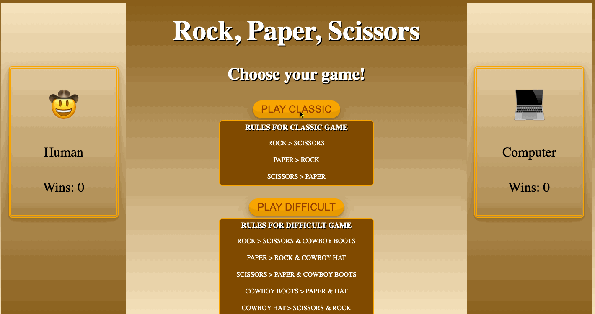

# Rock-Paper-Scissors

### Abstract:

Step into "Rock, Paper, Scissors: Wild West Showdown" – a fun twist on a classic game! Put on your cowboy hat and boots, and challenge our AI gunslinger to an epic duel. Outwit your Western rivals, as well as our witty AI, with strategic choices – rock, paper, or scissors. Keep it classic or add some spice. Experience thrilling matches, unexpected twists, and endless fun as you conquer the frontier. Saddle up for the ultimate showdown against both human-like AI and Western fighters!

### Installation Instructions:

1. Go to your GitHub repo
2. Settings -> Pages (left sidebar)
3. Build and deployment source: deploy from a branch
4. Branch: main /root
5. Your project will be live at https://github.com/AHochworter/rock-paper-scissors

### Preview of App:

### Context:

This concluding individual project was assigned in the fifth week of module 1 at the Turing School of Software and Design. A timeframe of seven days was granted for the completion of this project. The project's objective was to begin from ground zero and develop an application enabling users to engage in a game of rock, paper, scissors against a computer opponent.  I spent 40 hours on this project, with the largest effort going towards the javascript code.

### Contributors:

- [Ann Hochworter](https://github.com/AHochworter)

### Learning Goals:

- Solidify and demonstrate your understanding of:
  - DRY JavaScript
  - event delegation to handle similar event listeners
- Understand the difference between the data model and how the data is displayed on the DOM
- Use your problem solving process to break down large problems, solve things step by step, and trust yourself to not rely on an outside “answer” to a logical challenge

Tech used: Github, Terminal, VS Code, Dev Tools, Javascript, CSS, and HTML.

### Wins + Challenges:

Wins & Challenges: Got it! Though not without a little help along the way. I'm tagging this as a win/challenge because I battled those pesky "imposter syndrome" feelings here and there during the project. I dove in and put in the work, but I'll admit I also reached out for support from mentors, fellow cohorts, MDN documents, and quite a bit of trial and error. And guess what? That's why my application is now up and running smoothly!

Wins:

- Writing the skeleton HTML, guided by a wireframe's visual cues, marked a satisfying achievement in this project. The wireframe offered a clear "visual" roadmap for the essential sections and divs required in the HTML code.

* With help from a menotor, refactoring the game logic within the getWinner function was a nice win. What started as a sprawling mass of repetitive conditional statements was transformed into a sleek and simplified object structure, employing key:value pairs to seamlessly determine the victor of the game.

Challenges:

- Reaching a point in the build process where I had sufficient code to begin interacting with the logic posed a hurdle. Throughout the entire project build, I struggled with moments of uncertainty about the data model, leading to constant second-guessing.

* At certain points in the coding process, I encountered instances where the dev tools indicated that a function was modifying a classList to either add or remove the hidden attribute. However, the DOM wasn't reflecting these changes, and the visuals that were loaded remained unresponsive. Thankfully, with guidance from a mentor, I learned about node lists "aging" or not updating as expected. He helped me remedy this issue by adding a line of code to refresh the node list.
